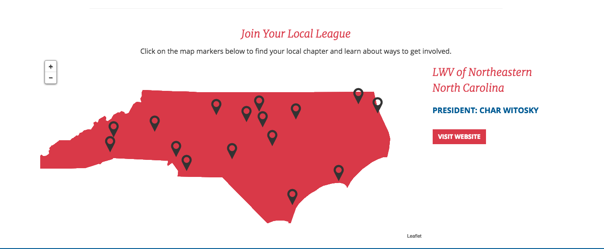

# Map for N.C. League of Women Voters site

## References
- GeoJSON for N.C. boundaries translated from shapefiles (from the U.S. Census Bureau)[https://www.census.gov/geo/maps-data/data/cbf/cbf_state.html]
- Images from the Facebook groups/websites of various League of Women Voters chapters
- [LeafletJS](https://leafletjs.com/)
- [MapBox](https://www.mapbox.com/)
